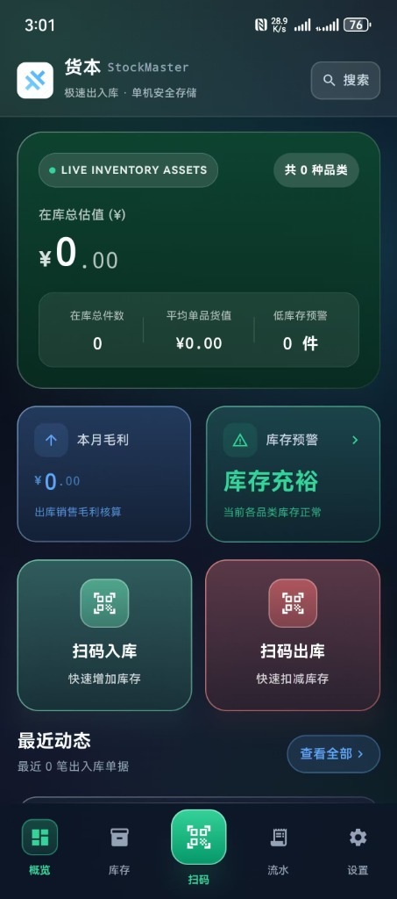
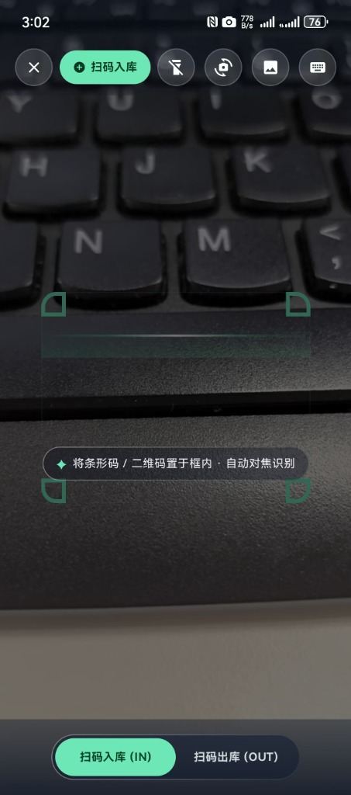
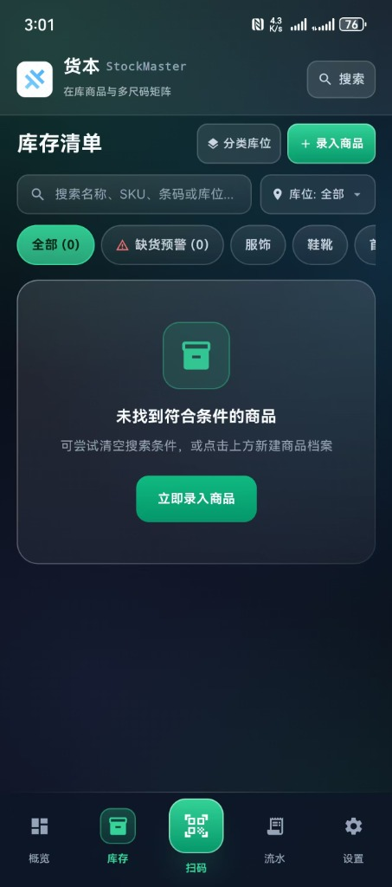
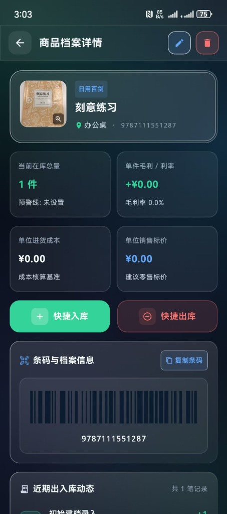
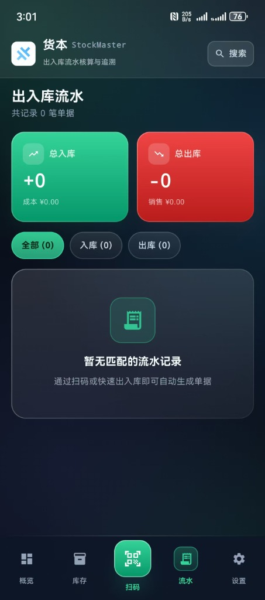

# 货本 StockMaster

> 个人卖家轻量级出入库管理工具 · 扫码即记、秒级出入、账货清晰、数据私有

<p align="center">
  <a href="https://developer.android.com"></a>
  <a href="https://kotlinlang.org"></a>
  <a href="https://developer.android.com/jetpack/compose"></a>
  <a href="app/build.gradle"></a>
  <a href="app/build.gradle"></a>
  <a href="LICENSE"></a>
  <a href="https://github.com/RenLeMond/StockMaster/releases"></a>
</p>

离线优先、零网络依赖的 Android 原生进销存工具。面向闲鱼 / 抖音小店 / 私域 / 档口等个人及微型卖家的全链路方案：扫码出入库、多尺码矩阵、库存预警、毛利核算、流水追溯与 SAF 本地备份。

<p align="center">
  <a href="https://github.com/RenLeMond/StockMaster/releases">⬇️ 下载 APK</a> · 
  <a href="#-screenshots--demo">📸 截图预览</a> · 
  <a href="#-quick-start">🚀 快速开始</a> · 
  <a href="#-faq">❓ 常见问题</a>
</p>

---

## 目录

- [📸 Screenshots / 截图预览](#-screenshots--demo)
- [✨ Features / 核心功能](#-features)
- [🚀 Quick Start / 快速开始](#-quick-start)
- [📖 Usage / 使用流程](#-usage)
- [🏗️ Architecture / 架构设计](#️-architecture)
- [🛠️ Tech Stack / 技术栈](#️-tech-stack)
- [🔒 Privacy & Offline / 离线与隐私](#-privacy--offline)
- [💾 Backup & CSV / 备份与导出](#-backup--csv)
- [❓ FAQ / 常见问题](#-faq)
- [🗺️ Roadmap / 路线图](#️-roadmap)
- [🤝 Contributing / 贡献指南](#-contributing)
- [📄 License & Acknowledgements / 协议与致谢](#-license--acknowledgements)

---

## 📸 Screenshots / Demo

| 仪表盘 | 扫码工作台 | 库存清单 | 商品详情 | 出入库流水 |
|:---:|:---:|:---:|:---:|:---:|
|  |  |  |  |  |

---

## ✨ Features

| | 能力 | 说明 |
|---|---|---|
| 📊 | **仪表盘一屏全览** | 总库存价值 / 平均价值、总件数 / 品类数、本月毛利、低库存预警、最近流水快照 |
| 📷 | **多模态扫码** | CameraX + ML Kit 实时识别（EAN-13/8、Code 128/39、UPC-A/E、QR，1200ms 防抖）· 闪光灯/前后摄/相册识别/手动输入 |
| 🔫 | **硬件扫码枪** | 全局 `dispatchKeyEvent` 拦截（[`ScannerGun.kt`](app/src/main/java/com/stockmaster/app/util/ScannerGun.kt)），<120ms + Enter 判定，输入框焦点自动放行 |
| 🎆 | **扫码即庆祝** | `ConfettiFireworksEffect` 满屏烟花 + `BeepPlayer` 声触反馈（[`BeepPlayer.kt`](app/src/main/java/com/stockmaster/app/util/BeepPlayer.kt)），1.6s 自动跳转详情 |
| 📦 | **库存高密度列表** | 3 行 Header 紧凑布局、模糊搜索（名/SKU/条码/库位）、容量进度条、低库存徽标、`QuickTransactionDialog` 快捷出入 |
| 👕 | **多尺码矩阵** | 预设 S-XXXL / 36-44 + 自定义，单码操作或 `Batch Size Breakdown` 批量配比，总库存自动联动 |
| 🏷️ | **商品全景** | CODE128 高清条码（[`BarcodeBitmap.kt`](app/src/main/java/com/stockmaster/app/util/BarcodeBitmap.kt)）、尺码分布柱状图、专属流水时间线、`PhotoViewerDialog` 捏合放大 |
| 🔍 | **全局检索** | 跨品类/条码/库位毫秒级联想，直达详情 |
| 💾 | **SAF 自主备份** | JSON 全量（含图片 Base64）/ CSV 商品/流水，`CreateDocument` / `OpenDocument`，无后台静默备份 |
| 🔒 | **离线私有** | 零 `INTERNET` 权限，`filesDir` 私有存储 + `.tmp` 原子重命名 + `Mutex` 串行互斥，扫码枪高频零竞态 |

---

## 🚀 Quick Start

### 方式一：下载安装（用户推荐）

1. 前往 [Releases](https://github.com/RenLeMond/StockMaster/releases) 下载最新 `app-release.apk`
2. 在 Android 设备上允许“安装未知应用”后完成安装
3. 首次启动使用扫码功能时授予相机权限即可

---

### 方式二：源码构建（开发者）

**环境要求**

- Android Studio Ladybug+ / Hedgehog+
- JDK 17 · `compileSdk 35` / `minSdk 23` / `targetSdk 35` · Gradle Wrapper 已内置

```bash
git clone https://github.com/RenLeMond/StockMaster.git
cd StockMaster

# 构建 Debug 包
# Windows
.\gradlew.bat assembleDebug
# macOS / Linux
./gradlew assembleDebug

# 安装到已连接设备/模拟器
.\gradlew.bat installDebug
# 或
adb install app/build/outputs/apk/debug/app-debug.apk
```

> **提示**：Release 构建可通过环境变量注入签名密钥：`SM_KEYSTORE_FILE`、`SM_KEYSTORE_PASSWORD`、`SM_KEY_ALIAS`、`SM_KEY_PASSWORD`。未配置时将构建未签名包。

---

## 📖 Usage

```
扫码入库/出库 → 抽屉确认 → 烟花庆祝 → 库存/详情核验 → 流水追溯 → 设置页备份
```

1. **扫码**：底部中央 CTA 或仪表盘快捷入口进入扫码工作台；支持摄像头、扫码枪、相册、手动输入
2. **确认**：抽屉内调整数量（+1/+5/+10/+50/+100）、进价/售价、库位、备注；多尺码可选单码或批量配比
3. **庆祝与跳转**：成功后满屏烟花，自动跳转商品详情页（[`AppRoot.kt`](app/src/main/java/com/stockmaster/app/ui/AppRoot.kt) 导航栈管理）
4. **库存管理**：在“库存”Tab 搜索/筛选/快捷出入；`+ 录入商品` 新建档案
5. **对账与备份**：在“流水”按类型/月份筛选；在“设置”导出 JSON/CSV 或恢复

---

## 🏗️ Architecture

- **导航**：[`AppRoot.kt`](app/src/main/java/com/stockmaster/app/ui/AppRoot.kt) 轻量 `Nav` 栈（`main` Tab + overlay 全屏页），`BackHandler` 统一回退，扫码枪请求去重路由。
- **状态**：单 [`MainViewModel.kt`](app/src/main/java/com/stockmaster/app/ui/MainViewModel.kt) + `StateFlow` + `collectAsStateWithLifecycle`，状态写入收敛主线程。
- **持久化**：脏标记 + `Mutex` 合并落盘，`Dispatchers.IO` 异步调度，[`JsonFileStore.kt`](app/src/main/java/com/stockmaster/app/data/JsonFileStore.kt) 以 `.tmp` + `renameTo` 原子写入。
- **主题**：固定 Light + Edge-to-Edge 透明系统栏（[`MainActivity.kt`](app/src/main/java/com/stockmaster/app/MainActivity.kt)）。

<details>
<summary>📁 项目结构</summary>

```
StockMaster/
├── app/
│   ├── build.gradle              # 签名/压缩/Compose/BuildConfig
│   └── src/main/
│       ├── AndroidManifest.xml   # 仅 CAMERA，无 INTERNET
│       ├── java/com/stockmaster/app/
│       │   ├── MainActivity.kt           # enableEdgeToEdge + ScannerGun 分发
│       │   ├── data/
│       │   │   ├── Models.kt             # InventoryItem / TransactionRecord / SizeVariant
│       │   │   ├── Repository.kt         # JSON 仓库门面
│       │   │   ├── JsonFileStore.kt      # .tmp 原子重命名 + 读容错
│       │   │   ├── BackupManager.kt      # BackupBundle（含内嵌图片）
│       │   │   ├── CsvManager.kt         # CSV（UTF-8 BOM）
│       │   │   ├── StockMath.kt          # 出入库校验与库存应用
│       │   │   └── ProductConstants.kt   # 预设分类/库位
│       │   ├── ui/
│       │   │   ├── AppRoot.kt            # 导航栈 + 底部浮岛 + 扫码枪路由
│       │   │   ├── MainViewModel.kt      # 全局状态 + Mutex 持久化
│       │   │   ├── theme/                # Color.kt / Theme.kt
│       │   │   ├── components/           # Confetti / CameraCapture / Glass / PhotoViewer ...
│       │   │   └── screens/              # Dashboard / Scan / Inventory / Detail / History / Settings
│       │   └── util/
│       │       ├── ScannerGun.kt / BeepPlayer.kt / BarcodeBitmap.kt
│       │       └── ImageUtils.kt / Fmt.kt
│       └── res/                          # mipmap / drawable splash / xml/file_paths
│   └── src/test/java/                    # FmtTest / StockMathTest / JsonFileStoreTest ...
└── gradle.properties / settings.gradle / build.gradle
```

</details>

<details>
<summary>📦 数据模型</summary>

定义见 [`Models.kt`](app/src/main/java/com/stockmaster/app/data/Models.kt)：

```kotlin
@Serializable
data class InventoryItem(
    val id: String, val sku: String, val barcode: String,
    val name: String, val category: String,
    val stock: Int, val minStock: Int, val maxCapacity: Int? = null,
    val unitCost: Double, val unitPrice: Double,
    val location: String, val imageUrl: String = "", // file://... 私有路径
    val unit: String = "件", val description: String = "",
    val hasSizes: Boolean = false,
    val sizeVariants: List<SizeVariant> = emptyList(),
    val updatedAt: String
)

@Serializable
data class TransactionRecord(
    val id: String, val itemId: String, val itemName: String, val sku: String,
    val type: TxType, // IN / OUT
    val quantity: Int, val unitPrice: Double, val totalPrice: Double,
    val reason: String, val location: String,
    val size: String? = null, val sizeBreakdown: List<SizeBreakdown> = emptyList(),
    val timestamp: String, val formattedTime: String? = null,
    val imageUrl: String = ""
)
```

`BackupBundle` 聚合 `items / transactions / categories / locations / images`（Base64 内嵌），跨设备恢复时物化至 `filesDir/images/` 并重映射路径。

</details>

---

## 🛠️ Tech Stack

| 维度 | 选型 |
|---|---|
| 语言 / 构建 | Kotlin 2.2.10 · AGP 9.3.1 · Gradle 9.x · JDK 17 |
| UI 框架 | Jetpack Compose BOM 2025.02.00 + Material3 · Edge-to-Edge |
| 状态架构 | 单 `MainViewModel` ([`MainViewModel.kt`](app/src/main/java/com/stockmaster/app/ui/MainViewModel.kt)) + `StateFlow` + `collectAsStateWithLifecycle` |
| 相机 / 扫码 | CameraX 1.4.1 (core/camera2/lifecycle/view) + ML Kit 17.3.0 + ZXing 3.5.3 |
| 图片处理 | Coil 2.7.0（仅 `file://` / data URI）+ ExifInterface + `ImageUtils` 私有目录解耦 |
| 序列化 / 存储 | `kotlinx-serialization-json` 1.8.0 · `JsonFileStore` 原子写 ([`JsonFileStore.kt`](app/src/main/java/com/stockmaster/app/data/JsonFileStore.kt)) |
| 协程与并发 | `kotlinx.coroutines` + `Mutex` 脏标记合并持久化 |
| 核心 AndroidX | `core-ktx` 1.15.0 · `activity-compose` 1.9.3 · `lifecycle-viewmodel-compose` 2.8.7 · desugar 2.1.5 |

---

## 🔒 Privacy & Offline

[`AndroidManifest.xml`](app/src/main/AndroidManifest.xml) 仅声明 `android.permission.CAMERA`（`required=false`），**未申请 `INTERNET` 权限**：

- **离线模型**：ML Kit 内置离线模型，Coil 仅加载本地 `file://` / data URI
- **本地存储**：数据 100% 存储于 `context.filesDir`（`items.json` / `transactions.json` / `categories.json` / `locations.json` + `images/img_*.jpg`），`allowBackup=false`
- **并发无竞态**：持久化采用 `.tmp` + `renameTo` 原子重命名，`Dispatchers.IO` + `Mutex` 串行互斥，硬件扫码枪高频连扫零竞态

---

## 💾 Backup & CSV

入口位于 **设置** 页面（[`SettingsScreen.kt`](app/src/main/java/com/stockmaster/app/ui/screens/SettingsScreen.kt)），通过 Android SAF 框架（`CreateDocument` / `OpenDocument`）由用户自主触发，绝无后台静默操作。

| 操作 | 格式 | 编码 | 说明 |
|---|---|---|---|
| 全量备份 | JSON (`BackupBundle`) | UTF-8 | 含商品内嵌 Base64 图片，跨机一键恢复 |
| 全量恢复 | JSON | UTF-8 | 校验 `version`/`appName`，自动物化图片到私有目录 |
| 商品档案导出/导入 | CSV | UTF-8 BOM | 导入时以 `SKU`/`条码` 为键合并覆盖 |
| 流水记录导出/导入 | CSV | UTF-8 BOM | 导入时按 `id` 去重并按 `SKU` 自动回填 `itemId` |

---

## ❓ FAQ

**Q1 扫码枪扫不上 / 与输入法冲突？**
`ScannerGun` 仅当按键间隔 <120ms 且以 Enter 结尾时判定为扫码，且在文本框聚焦时自动放行。请在非编辑状态下扫码，或检查扫码枪是否已配置为“回车后缀”模式。

**Q2 备份后跨设备恢复图片丢失？**
旧格式备份无 `images` 字段属正常；新格式已内嵌 Base64，恢复时物化至 `filesDir/images/`。若仍不显示，请确认备份文件为最新版本导出的 JSON。

**Q3 数据文件在哪？如何手动清理？**
私有目录 `filesDir` 下 `items.json` 等 + `images/`。卸载即清除；应用内“清空全部数据”会重置分类/库位为预设并递归删除 `images/`。建议操作前在设置页导出备份。

---

## 🗺️ Roadmap

| 版本 | 状态 | 内容 |
|---|---|---|
| v1.0.0 | ✅ 已发布 | 首次正式发布：多模态扫码 / 多尺码矩阵 / 仪表盘 / 流水追溯 / SAF 本地备份 / 烟花声触反馈 |
| v1.1.0 | 🚧 规划中 | ESC/POS 蓝牙热敏标签打印 · 多仓库独立核算 · 本地加密数据包一键快传与跨设备备份 |
| Backlog | 💡 候选 | 桌面端 CSV 模板校验工具 · 条码批量生成与打印排版 |

> 变更记录详见 [GitHub Releases](https://github.com/RenLeMond/StockMaster/releases)。

---

## 🤝 Contributing

欢迎提交 Issue 和 Pull Request！

```bash
# 提交前自检
.\gradlew.bat lint
.\gradlew.bat testDebugUnitTest
```

- 分支规范：`feature/*` / `fix/*` → PR 到 `main`
- 提交信息：`feat/fix/docs/refactor: 摘要`（动词开头）
- 代码风格：遵循官方 Kotlin 编码规范，Compose 遵循 Material 3 设计标准

---

## 📄 License & Acknowledgements

本项目基于 **MIT License** 开源 — 详见 [LICENSE](LICENSE)。

### 💖 致谢开源项目
- [CameraX](https://developer.android.com/jetpack/androidx/releases/camera) · [ML Kit Barcode Scanning](https://developers.google.com/ml-kit/vision/barcode-scanning) · [ZXing](https://github.com/zxing/zxing)
- [Jetpack Compose / Material3](https://developer.android.com/jetpack/compose) · [Coil](https://coil-kt.github.io/coil/) · [kotlinx.serialization](https://github.com/Kotlin/kotlinx.serialization)
